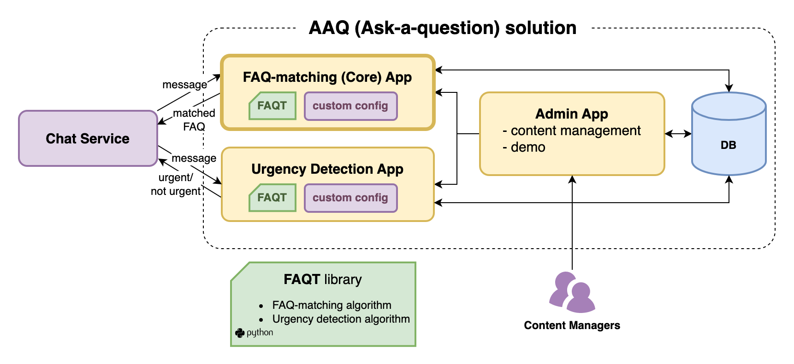

[](https://coveralls.io/github/IDinsight/aaq_admin_template?branch=main)


# Ask A Question (AAQ) Core Template Repository

This template provides a ready-to-use solution for an FAQ-matching application that can
be used by an existing chat service. It uses FAQ-matching models from the 
[FAQT](https://github.com/IDinsight/faqt) library.

This module is the core application that receives inbound messages in json, matches them
to FAQs in the database, and returns the top N matches as json.



To start development on a new AAQ solution, clone or fork this and follow the setup instructions below.

Ensure to pull in new features from this repository regularly.

## Setup

### Copy this code

Clone or fork this repository.

If you clone this, please setup a new repository for future commits and add this repository as another remote - called `template`. This will allow you to pull in new changes made to this template. Here are the instructions on how to do this:

1. Clone this repo

    ```
    git clone git@github.com:IDinsight/aaq_core_template.git <project_name>
    ```

2. Switch to <project_name> folder and change remote name to `template`

    ```
    git remote rename origin template
    ```

3. Create a new repo in Github
4. Add it as remote for local repo

    ```
    git remote add origin git@github.com:<user_name>/<project_name>.git
    ```

5. Set local to track that remote

    ```
    git push -u origin main
    ```

6. You may also wish to [set your environment variables](https://docs.conda.io/projects/conda/en/latest/user-guide/tasks/manage-environments.html#setting-environment-variables) for the conda environment. This will allow you to run and test locally. Here are the variables you should set

    ```
    export PG_ENDPOINT=
    export PG_PORT=
    export PG_DATABASE=
    export PG_USERNAME=
    export PG_PASSWORD=

    export INBOUND_CHECK_TOKEN=
    export PROMETHEUS_MULTIPROC_DIR=
    ```
    See `docs/deployment_instructions.md` for more detailed explanations of each secret environment variable.

### Configure project details

The `project_config.cfg` in the root directory should be updated with your project details.

* `PROJECT_NAME`: Project repository name
* `PROJECT_SHORT_NAME`: Short name for the project. Make sure to choose a value that contains only lowercase letters and hyphens (e.g. my-project).
* `PROJECT_CONDA_ENV`: Name for the conda environment for local development.
* `AWS_ACCOUNT_ID`: AWS account ID for testing, development, and staging resources
* `AWS_REGION`: AWS region for testing, development, and staging resources
* `AWS_BILLING_CODE`: Tag for billing code for AWS resources
* `AWS_PROFILE_NAME`: Name of AWS profile (stored in `~/.aws/credentials`) with appropriate permissions to create the resources

### Initialise
#### Run `make setup-dev`

This command does the following:

1. Creates a `conda` virtual environment
2. Installs dependencies from `requirements.txt` and `requirements_dev.txt`
3. Installs pre-commit hooks
4. Creates secrets files in `./secrets/`

#### Set up infrastructure using terraform

Follow the instructions in  [`infrastructure/README.md`](https://github.com/IDinsight/aaq_core_template/tree/main/infrastructure).

#### Set up secrets and test configs
Edit each of the files in `./secrets` and set the correct parameters.

Note the DB connection details and DB secrets, and save them in the following files:

- Save the dev DB details in `secrets/database_secrets.env`

- Save the test DB details in `tests/config.yaml`. This file is used by `pytest` and is required to run tests locally.

- Save the test DB details `validation/config.yaml`. This is used by the validation
  script.

See `docs/deployment_instructions.md` for more detailed explanations on each secret environment variable.

#### Run `make setup-ecr`

This creates the ECR repository for the project to store docker images.

#### Setup Github secrets

Note the secrets setup for this repository in Github. Ensure that these are also created in your repo.

### Data and config

#### Embeddings binaries

You only need to copy the binaries for the model you wish to use. The model can be set in the `core_model/app/config/parameters.yml` file.

-   Copy the pre-trained models to `data/pretrained_wv_models`
-   Copy the custom models to `data/custom_word_embedding`

#### Configure to context

1. Update the files under `core_model/app/contextualization/`
2. (OPTIONAL) update `core_model/app/config/parameters.yml`

## Other tasks

1. Setup `coveralls`
2. Setup auto deployment on EC2 (using webhooks or other)
3. Update this file!
    - Remove irrelevant content (all the template text)
    - Update the badges at the top of this file
4. Setup application monitoring
5. Setup other apps as necessary

## Running the project

**Note: Ensure you have updated all the secrets in the files under `/secrets/`.**

To run this project:

1. `make image` to create the docker image
2. `make container` to create the docker container

## Setting up secrets for Github Actions

Github actions scripts in `.github` requires the same or similar secrets as in the
`secrets` folder.

You can either set them directly as Github Actions secrets, or store them in AWS Secrets
Manager and dynamically load them during Github Actions.

For both options, you must set AWS credentials as Github Actions secrets:
```bash
AWS_ACCESS_KEY_ID
AWS_REGION
AWS_SECRET_ACCESS_KEY
```

### Option 1: Set Github Actions secrets
If you would like to set Github Actions secrets directly, in addition to AWS credentials above, you must set the following secrets:
```bash
# From `secrets/databse_secrets.env`
GA_PG_ENDPOINT
GA_PG_PASSWORD

# From `secrets/app_secrets.env`
GA_INBOUND_CHECK_TOKEN

# Validation data S3
VALIDATION_BUCKET  # S3 bucket storing validation data
VALIDATION_DATA_PREFIX  # Prefix of validation data in the S3 bucket
VALIDATION_FAQ_PREFIX  # Prefix of FAQ data in the S3 bucket
```

Make sure to comment out the block of code that uses secrets from AWS, and uncomment the
block that uses GA secrets in `.github/validation-test.yml` and `.github/docker-build-push.yml`.

### Option 2: Load secrets from AWS Secrets Manger (default)
If you would like to load secrets from AWS Secrets Manager, make sure that you have the
following secrets stored on AWS:

1. Core secrets
    ```bash
    # From `secrets/app_secrets.env`
    INBOUND_CHECK_TOKEN  
    ENABLE_FAQ_REFRESH_CRON

    # For validation data
    VALIDATION_BUCKET  # S3 bucket storing validation data
    VALIDATION_DATA_PREFIX  # Prefix of validation data in the S3 bucket
    VALIDATION_FAQ_PREFIX  # Prefix of FAQ data in the S3 bucket
    ```

2. Global secrets (to be used also by the admin app, and optionally, UD app)
    ```bash
    # From `secrets/databse_secrets.env`
    PG_ENDPOINT
    PG_PASSWORD
    PG_PORT
    PG_USERNAME
    PG_DATABASE

    # From `secrets/sentry_config.env`
    SENTRY_DSN
    SENTRY_ENVIRONMENT
    SENTRY_TRACES_SAMPLE_RATE
    ```

3. Staging DB secrets -- this should be automatically created under the secret named `<PROJECT_SHORT_NAME>-db` if you used terraform.
    ```bash
    db_endpoint
    db_password
    db_username
    ```


Make sure to modify the secrets ARNs in `.github/validation-test.yml` and
`.github/docker-build-push.yml` to your own ARNs.

## Thank you

This has been built for and in collaboration with Praekelt. We are grateful to
Praekelt for the opportunity to use data science to contribute to their mission.
