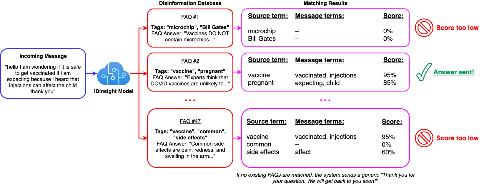

# Ask A Question (AAQ) Template Repository

This is the readme for the AAQ Template repository. To start development on a new AAQ solution, cloning or forking this and follow the setup instructions below.

Ensure to pull in new features from this repository regularly.

## What is this?

This module is the core application that receives inbound messages in json, matches them to FAQs in the database, and returns the the top N matches as json.

## Setup

### Copy this code

Clone or fork this repository. If you clone this, please setup a new repository for future commits and add this repository as another remote - possibly called `upstream`. This will allow you to pull in new changes made to this template.

### Configure project details

The `project_config.cfg` in the root directory should be updated with your project details

### Initialise

#### Create a Postgres Db instance

In past projects, this has been Postgres on RDS. You don't need to create any databases at this point. We'll create that in one of the steps below.

Note the connection details for the DB and the password for the `postgres` user. We'll need them in the [section](#enter_details_in_secrets_file) below.

#### `make setup-dev`

This command does the following:

1. Creates a `conda` virtual environment
2. Installs dependencies from `requirements.txt` and `requirements_dev.txt`
3. Installs pre-commit hooks
4. Creates secrets files in `./secrets/`

#### Enter details in secrets file

You should edit each of the files in `./secrets` and set the correct parameters.

-   `database_secrets.env` is the most important one to complete right now as these details will be used to create tables in the next step. You can set whatever username and password you prefer. These details will be used to create the role.

-   `tests/config.yaml` should also be updated. This file is used by `pytest` and is required to run tests locally.

-   Other files should be updated before you can test the instance.

#### `make setup-db-all`

This command does the following:

1. Creates the dev and test user
2. Creates the dev and test databases
3. Creates a new schema (based on `$PROJECT_SHORT_NAME`) and sets as default
4. Creates the tables needed for the app

#### Setup Github secrets

Note the secrets setup for this repository in Github. Ensure that these are also created in your repo.

### Data and config

#### Pre-trained model

Copy (or symlink) the pre-trained Google News model to `data/pretrained_wv_models`.

#### Configure to context

1. Update the files under `core_model/app/contextualization/`
2. (OPTIONAL) update `core_model/app/config/parameters.yml`

## Other tasks

1. Setup `coveralls`
2. Setup auto deployment on EC2 (using webhooks or other)
3. Update this file!
  1. Remove irrelevant content (all the template text)
  1. Update the badges at the top of this file
6. Setup application monitoring
7. Setup other apps as necessary,

## Running Project

**Note: Ensure you have updated all the secrets in the files under `/secrets/`.**

To run this project:

1. `make image` to create the docker image
2. `make container` to create the docker container
