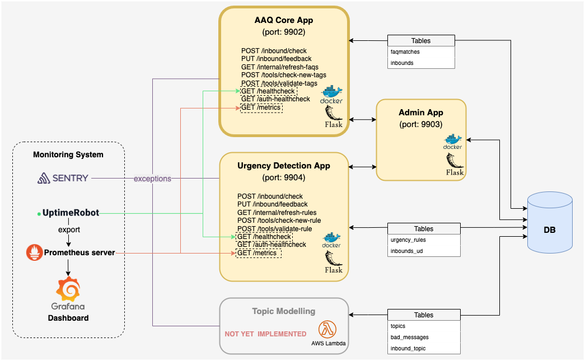

June 2, 2022

CURRENT VERSION: aaq_core_template:v1.0.0
# Deploying the AAQ Core App

This is the deployment instructions for the **AAQ Core App**. It does not cover deployment of the Admin app (from `aaq_admin_template`) or the UD app (`aaq_ud_template`).

# Initial setup

1. Save GoogleNews pretrained model binary, to be mounted onto the containers. Download from https://www.dropbox.com/s/0ah0kslf7ac199g/GoogleNews-vectors-negative300-prenorm.bin?dl=0, and un-zip (so file is ``.bin`).
    - You could also have this `.bin` in S3, so that whenever cluster instances are launched, they copy from S3 and then mount into the container.

2. Setup DB tables using `scripts/core_tables.sql`.

# Images

The Docker image for the core model server is hosted on GHCR at
`ghcr.io/idinsight/aaq_core_template:v1.0.0`

You'll need a token to access the image. Please contact IDinsight for this token.

## Resources for images

The core model runs well (serving ~100 requests/second) on an AWS `m5.xlarge` instance .

## Image setup

* The inbound port mapping is 9902:9902 (TCP).
* The GoogleNews pretrained binary (described above) must be mounted to the following target inside the container: `/usr/src/data/pretrained_wv_models/GoogleNews-vectors-negative300-prenorm.bin`
* Mount a folder that is cleared at startup to the following target: `/tmp`

### Environment variables
The following environment variables are required:
- Postgres
  - `PG_ENDPOINT`: Postgres instance endpoint
  - `PG_PORT`: Postgres port
  - `PG_DATABASE`: Database name
  - `PG_USERNAME`
  - `PG_PASSWORD`
- Sentry
  - `SENTRY_DSN`
  - `SENTRY_ENVIRONMENT`
  - `SENTRY_TRANSACTIONS_SAMPLE_RATE=1.0`
- `INBOUND_CHECK_TOKEN`: Bearer token. Requests to `/inbound/check` and `/auth-healthcheck` must be authenticated with this bearer token in the header. We recommended an alphanumeric string of your choice.
- `DEPLOYMENT_ENV`
    - For production, this should be set to `DEPLOYMENT_ENV=PRODUCTION`. This disables the **tag check** and **tag validation** endpoints for stability.
    - Note that the admin app (based on `aaq_admin_template`) depends on **tag check** and **tag validation** endpoints. Thus, the admin app should always point to a non-production instance of the core AAQ model app.
- `ENABLE_FAQ_REFRESH_CRON`: Only set to "true" if you'd like to run a cron job within the containers to periodically refresh FAQs.
- `PROMETHEUS_MULTIPROC_DIR`: Directory to save prometheus metrics collected by multiple processes. It should be a directory that is cleared regularly (e.g. `/tmp`)

### Jobs

* Setup job in kubernetes to call `/internal/refresh-faqs` every day. (You may want to set `ENABLE_FAQ_REFRESH_CRON=false`.)

# Monitoring
You can configure your existing Prometheus server, UptimeRobot, and Grafana as follows to monitor the core app. See the diagram at the top to see how the different components interact with each other.

## Prometheus Server
Scrape metrics from `GET /metrics`.

## UptimeRobot
Add monitors to watch the `/healthcheck` endpoint.

## Grafana
Define new data sources in `monitoring/grafana/datasource.yaml`. If you already have Grafana connected to Prometheus, you may not need to do this step.

Add providers, defined under `monitoring/grafana/dashboard.yaml`.

Add new dashboard, defined under `monitoring/grafana/dashboard/`. At present there is just one file in there called `mc_aaq_dashboard.json`.
